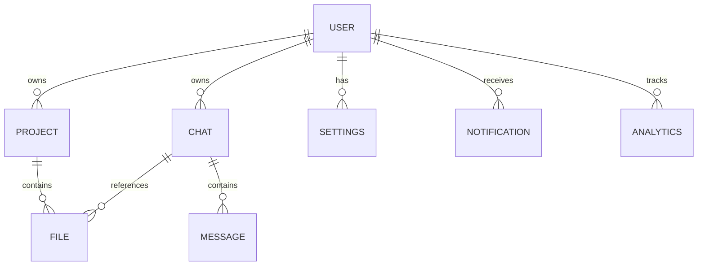

# Backend Architecture & Schema

## 1. MongoDB Schemas (Mongoose)

### ER Diagram

### Schemas Details
**1. Users:** `_id`, `email`, `passwordHash`, `name`, `role`, `createdAt`, `updatedAt`
**2. Projects:** `_id`, `userId`, `name`, `description`, `status`, `createdAt`, `updatedAt`
**3. Chats (AI Sessions):** `_id`, `userId`, `projectId` (optional), `title`, `createdAt`
**4. Messages:** `_id`, `chatId`, `role` (user/ai), `content`, `tokensUsed`, `createdAt`
**5. Files:** `_id`, `userId`, `projectId`, `filename`, `s3Url`, `fileType`, `createdAt`
**6. Analytics:** `_id`, `userId`, `eventAction`, `eventCategory`, `metadata` (JSON), `createdAt`
**7. Notifications:** `_id`, `userId`, `type`, `message`, `read` (Boolean), `createdAt`
**8. Settings:** `_id`, `userId`, `theme`, `emailAlerts`, `apiKey` (if BYOK)

## 2. API Design (REST)

### Authentication (`/api/auth`)
- `POST /api/auth/signup` - Register user.
- `POST /api/auth/login` - Authenticate & return JWT.

### User Management (`/api/user`)
- `GET /api/user` - Get current user profile.
- `PUT /api/user` - Update profile/settings.

### AI Interaction (`/api/ai`)
- `POST /api/ai/chat` - Send prompt & history to Gemini. Returns AI response stream/JSON.
- `POST /api/ai/upload` - Upload file to storage, extract text for AI context.

### Analytics (`/api/analytics`)
- `GET /api/analytics` - Retrieve usage stats (e.g., token usage, interaction counts) for Dashboard KPIs.

### Notifications (`/api/notifications`)
- `GET /api/notifications` - Fetch unread alerts.
- `PUT /api/notifications/:id/read` - Mark read.
