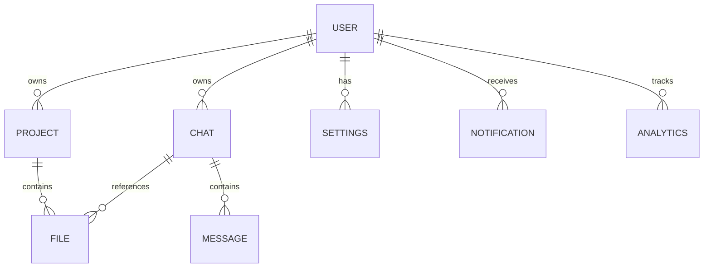

# Template 1: Reusable AI SaaS Dashboard Blueprint

This document serves as the absolute source of truth and implementation-ready specification for the highly reusable AI SaaS Dashboard Template. It is designed to be adapted into multiple products (AI Tutor, Study Planner, Healthcare Assistant, etc.).

---

## 1. Product Requirement Document (PRD)

### Goal
Build a production-quality, highly reusable SaaS template that can be quickly rebranded and customized for any future hackathon problem statement.

### The Architecture Focus
- **Reusability:** Abstracted AI layers and generic dashboards.
- **Scalability:** Horizontal scaling, caching, robust DB.
- **Rapid Iteration:** Pre-built, customizable UI components.
- **Clean Code & Professional Presentation:** Judge-friendly, premium startup-grade aesthetics.

---

## 2. Information Architecture (Sitemap)

- **Landing Page (`/`)**
  - Navbar, Hero Section, Features Section, How It Works, Testimonials, Pricing, FAQ, Footer
- **Authentication**
  - Login (`/login`)
  - Signup (`/signup`)
  - Forgot Password (`/forgot-password`)
  - Reset Password (`/reset-password`)
- **Application Core (`/app`)**
  - Dashboard (`/app/dashboard`)
  - Profile (`/app/profile`)
  - Settings (`/app/settings`)
  - Notifications (`/app/notifications`)
  - Analytics (`/app/analytics`)
  - History (`/app/history`)
  - Admin Panel (`/app/admin`)
- **AI Workspace (`/app/workspace`)**
  - Chat Interface, Prompt Input, Conversation History, File Upload, AI Output Viewer, Export Functionality, Suggested Prompts.

---

## 3. User Flows

### A. Authentication Flow
1. User lands on `/` and clicks "Get Started".
2. Directed to `/signup`. User inputs credentials.
3. API validates input via Zod and creates DB record. Returns JWT.
4. User redirected to `/app/dashboard`.

### B. Core Dashboard Flow
1. User logs in and arrives at Dashboard.
2. Views KPI Cards, Activity Feed, Analytics Charts, and AI Insights Panel.
3. User selects a Quick Action or a Recommended Prompt.

### C. AI Workspace Flow
1. User navigates to `/app/workspace`.
2. Uploads a file (optional) and types a prompt.
3. System shows Loading State (Framer Motion skeleton/spinner).
4. Backend streams or returns AI Output.
5. User views output, saves to History, or Exports to PDF/Markdown.

---

## 4. Design System

**Inspiration:** Linear, Vercel, Stripe, OpenAI, Notion, Raycast.
**Vibe:** Premium, Minimal, Modern, Clean, Professional.

### Typography
- **Font Family:** `Inter` (UI) and `Geist` or `Outfit` (Headings)
- **Heading Scale:** H1 (3.75rem), H2 (3rem), H3 (2.25rem), H4 (1.875rem), H5 (1.5rem), H6 (1.25rem)
- **Body Scale:** Base (1rem), Sm (0.875rem), Xs (0.75rem)

### Color Palette
- **Primary:** Black (`#000000`) or White (`#ffffff`) depending on Dark/Light mode.
- **Secondary:** Neutral Gray (`#737373`)
- **Accent:** Electric Blue (`#3b82f6`) or Purple (`#8b5cf6`)
- **Success:** Emerald (`#10b981`)
- **Warning:** Amber (`#f59e0b`)
- **Error:** Rose (`#e11d48`)
- **Background:** Slate 950 (`#020617`) for Dark Mode.
- **Surface:** Slate 900 (`#0f172a`)
- **Border:** Slate 800 (`#1e293b`)
- **Text:** Slate 50 (`#f8fafc`)

### Spacing & Layout
- **Spacing:** standard Tailwind scale (4px base) -> `p-4`, `p-8`, `gap-6`
- **Radius:** `rounded-xl` (12px) for Cards/Modals, `rounded-md` (6px) for Buttons/Inputs.
- **Shadow:** `shadow-sm` (subtle border shadow), `shadow-lg` (glassmorphism elevations), `shadow-2xl` (Modals).

### Components (shadcn/ui base)
- **Buttons:** Subtle hover state scaling (`scale: 0.98`), disabled opacity (0.5).
- **Cards:** Border-gradient or glassmorphism (backdrop-blur-md, bg-white/5).
- **Inputs:** Clean bottom borders or subtly rounded boxes with primary color focus rings.
- **Command Palette:** Centralized global search (Cmd+K).
- **Toast:** Bottom-right slide-in notifications.

### Animation System (Framer Motion)
- **Page Transitions:** Fade in + Slide up (`opacity: [0, 1]`, `y: [10, 0]`, `duration: 0.3`).
- **Hover States:** Button scale down, Card slight lift (`y: -2`).
- **Loading:** Shimmer skeletons, elegant spinner.
- **Scroll Animations:** Fade-in text as it enters viewport (Landing page).

### 3D & Visual Layer (Three.js/R3F)
*Use WebGL sparingly for performance.*
- **Aurora Hero:** A slow-moving, elegant GLSL Aurora shader behind the main landing page text.
- **Interactive Cursor:** A subtle particle system or glow that follows the cursor across dark backgrounds.
- **Mesh Gradients:** Smooth, animated gradient backgrounds for auth screens.

---

## 5. Database Architecture (MongoDB)

### ER Diagram

### Schemas

**1. Users**
`_id`, `email`, `passwordHash`, `name`, `role`, `createdAt`, `updatedAt`

**2. Projects**
`_id`, `userId`, `name`, `description`, `status`, `createdAt`, `updatedAt`

**3. Chats (AI Sessions)**
`_id`, `userId`, `projectId` (optional), `title`, `createdAt`

**4. Messages**
`_id`, `chatId`, `role` (user/ai), `content`, `tokensUsed`, `createdAt`

**5. Files**
`_id`, `userId`, `projectId`, `filename`, `s3Url`, `fileType`, `createdAt`

**6. Analytics**
`_id`, `userId`, `eventAction`, `eventCategory`, `metadata` (JSON), `createdAt`

**7. Notifications**
`_id`, `userId`, `type`, `message`, `read` (Boolean), `createdAt`

**8. Settings**
`_id`, `userId`, `theme`, `emailAlerts`, `apiKey` (if BYOK)

---

## 6. API Architecture (REST)

**Authentication (`/api/auth`)**
- `POST /api/auth/signup` - Register user.
- `POST /api/auth/login` - Authenticate & return JWT.

**User Management (`/api/user`)**
- `GET /api/user` - Get current user profile.
- `PUT /api/user` - Update profile/settings.

**AI Interaction (`/api/ai`)**
- `POST /api/ai/chat` - Send prompt & history to Gemini. Returns AI response stream/JSON.
- `POST /api/ai/upload` - Upload file to storage, extract text for AI context.

**Analytics (`/api/analytics`)**
- `GET /api/analytics` - Retrieve usage stats (e.g., token usage, interaction counts) for Dashboard KPIs.

**Notifications (`/api/notifications`)**
- `GET /api/notifications` - Fetch unread alerts.
- `PUT /api/notifications/:id/read` - Mark read.

---

## 7. Security & Scalability

### Security
- **Authentication:** Stateless JWT stored in secure HttpOnly cookies (or Memory + Refresh token).
- **Hashing:** `bcryptjs` (Cost factor: 10) for passwords.
- **Validation:** `zod` schemas for every API input body.
- **Rate Limiting:** IP-based rate limiter (e.g., `express-rate-limit`) on Auth and AI endpoints to prevent abuse.
- **Protected Routes:** Next.js middleware checking JWT before allowing access to `/app/*`.

### Scalability
- **Horizontal Scaling:** Stateless Node.js backend can be replicated across Docker containers (Render/ECS).
- **API Layer:** Separated from frontend via `/api` routes (can be Serverless Next.js functions or dedicated Express server).
- **Database Scaling:** MongoDB Atlas auto-scaling, indexing on `userId` and `createdAt` for fast queries.
- **Caching:** Redis cache for frequent queries (e.g., User Settings, repeated AI prompts).
- **Future AI Scaling:** Message queues (RabbitMQ/Bull) for long-running AI background tasks.

---

## 8. Git Workflow Milestones

Development will be strictly collaborative using `main`, `frontend`, and `backend` branches.

### Milestone 1: Backend Foundation
- Connect MongoDB, configure Express.
- Build User Schema and Auth APIs.

### Milestone 2: Frontend Foundation & Design System
- Setup Tailwind, Fonts, Colors, and shadcn/ui.
- Implement UI Components (Buttons, Inputs, Cards).

### Milestone 3: Landing Page & Auth UI
- Build Aurora WebGL background, Hero, Features.
- Build Login/Signup forms connected to Backend.

### Milestone 4: Application Dashboard
- Build Sidebar, Navbar, KPI Layout, and Charts.
- Fetch user analytics from Backend.

### Milestone 5: AI Workspace Integration
- Build Chat Interface and File Upload UI.
- Implement `/api/ai/chat` in Express integrating Gemini.
- Connect Frontend to AI API, add Framer Motion loading states.

### Milestone 6: Polish & Deployment
- Ensure responsive design and cross-browser testing.
- Deploy to Vercel (Frontend) and Render (Backend).
